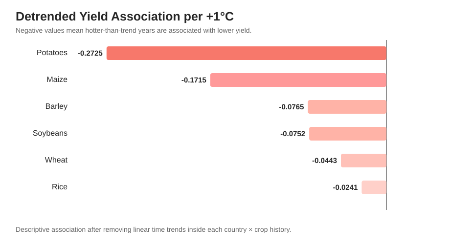
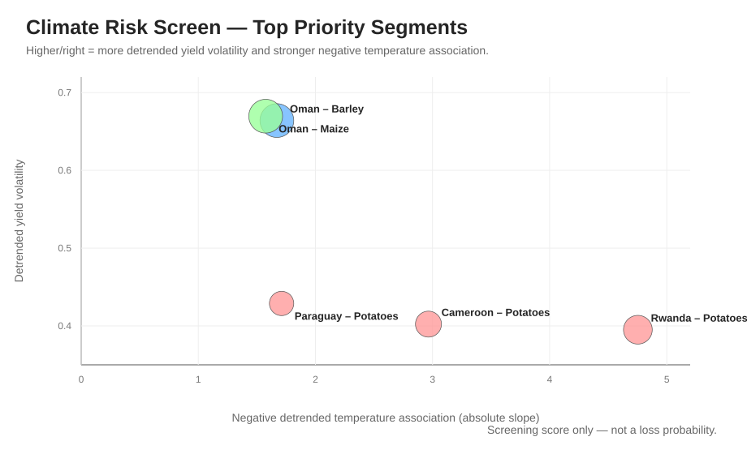
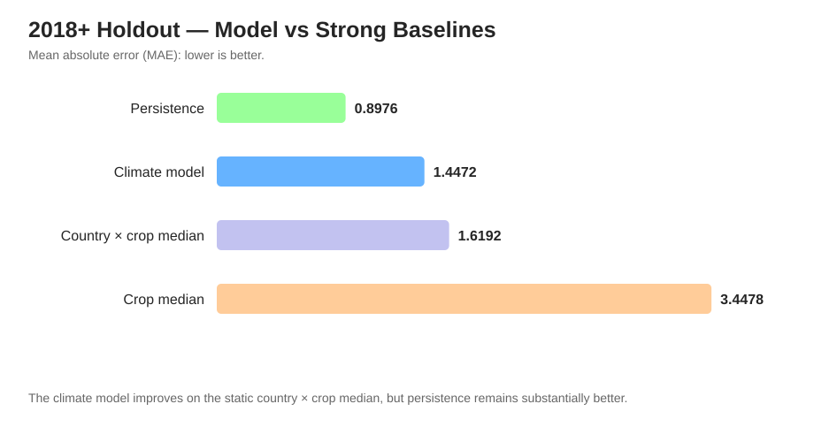

# Climate Crop Yield Intelligence 🌾🌍

### From warming to yield: where climate risk hits agriculture first.

[](https://github.com/Wadee19/climate-crop-yield-intelligence/actions/workflows/ci.yml)
[](https://github.com/Wadee19/climate-crop-yield-intelligence/actions/workflows/live-data-smoke.yml)


## What is this project?

This project studies one simple question:

> **Which crops and countries look more exposed to climate pressure, and can climate data improve crop-yield forecasting?**

I use real public data for **six crops** across **187 countries / territories** from **1990 to 2023**. The analysis combines crop yield, temperature, precipitation, fertilizer and irrigation data.

The project has two goals:

- find crop-location combinations that deserve attention first;
- test whether annual climate information improves prediction beyond simple historical baselines.

The main result is simple: climate variables add useful information, but **recent yield history is still the stronger short-term predictor** in this V1 model. The climate relationships in this project are treated as **associations, not causal effects**.

---

## V1 at a glance

| | Live validated result |
|---|---:|
| Country × year × crop records | **24,892** |
| Countries / territories | **187** |
| Crops | **6** |
| Analysis period | **1990–2023** |
| Yield coverage | **100%** |
| Temperature / precipitation coverage | **97.59%** |
| Fertilizer coverage | **97.15%** |
| Irrigation coverage | **22.64%** |

Crops in V1:

`Wheat` · `Maize` · `Rice` · `Potatoes` · `Soybeans` · `Barley`

The notebook was also run end-to-end in Google Colab with all outputs and figures saved.

---

## The story in three charts

### 1. After removing long-term trends, hotter years are associated with lower yield



After detrending each country × crop history, all six pooled crop slopes are negative. The strongest associations are:

- **Potatoes:** -0.2725 t/ha per +1°C
- **Maize:** -0.1715 t/ha per +1°C

These are descriptive associations, not causal temperature effects.

### 2. Risk is local



The risk screen combines:

- detrended yield volatility;
- a negative detrended temperature-yield association.

The highest V1 priority segments are led by **Oman–Barley**, **Oman–Maize**, and **Rwanda–Potatoes**.

This is a prioritization screen, not an insurance probability.

### 3. The strongest baseline wins



The model trains on data before 2018 and is tested on 2018–2023.

| 2018+ holdout | MAE, t/ha |
|---|---:|
| Persistence: last pre-2018 yield | **0.8976** |
| Climate-anomaly residual model | **1.4472** |
| Country × crop historical median | **1.6192** |
| Crop median baseline | **3.4478** |

The climate-anomaly model improves on the static country × crop median by **10.62%** and reaches **R² = 0.9038**.

But persistence is clearly stronger.

> **Main client message:** recent production history is more useful for short-horizon yield prediction than annual climate anomalies alone.

That is a useful result, even though the more complicated model does not win.

---

## What I found

| Question | V1 result |
|---|---|
| Which crop improved most? | **Maize**, +121.6% median yield change |
| Strongest negative detrended temperature association? | **Potatoes**, -0.2725 t/ha per +1°C |
| Top risk-screen segment? | **Oman – Barley** |
| Climate model MAE | **1.4472 t/ha** |
| Model R² | **0.9038** |
| Best forecasting baseline | **Persistence**, 0.8976 MAE |
| Hardest crop for the model | **Potatoes**, ~3.89 t/ha MAE |
| Lowest crop-level model error | **Soybeans**, ~0.42 t/ha MAE |

---

## Why this project is different

This is not a notebook full of unrelated plots.

The project follows one decision story:

**Business question → evidence → interpretation → limitation → client action**

It also corrects several shortcuts from the earlier university analysis:

| Earlier shortcut | V1 approach |
|---|---|
| Raw correlation = impact | Association is separated from causation |
| One exact temperature = “best” | Temperature ranges / bins |
| Compare naturally hot and cold countries | Within-country climate deviations |
| Ignore long-term productivity trend | Country × crop detrending |
| Random train/test split | Past → future time split |
| One weak baseline | Crop median + country-crop median + persistence |
| Use every available feature | Coverage decides whether a feature belongs in the core model |
| Show only good model results | Baseline failure and error analysis are explicit |
| Notebook-only project | Notebook + package + tests + CI + live-data validation |

---

## Data

The notebook downloads public data directly from reproducible Our World in Data Grapher CSV endpoints.

- **Crop yields:** FAO Production: Crops and livestock products
- **Temperature & precipitation:** Copernicus Climate Change Service / ERA5
- **Fertilizer & irrigation:** FAO / World Bank indicator series

Only ISO-3 country / territory rows are kept. OWID regional aggregates such as `OWID_AFR` and `OWID_WRL` are excluded.

Irrigation has only **22.64%** observed coverage in the final panel, so it is used for exploratory analysis only and is deliberately excluded from the core predictive model.

See [`docs/data_sources.md`](docs/data_sources.md) and [`docs/methodology.md`](docs/methodology.md).

---

## Business questions

1. Which crops improved the most since 1990?
2. What happens in warmer-than-trend years?
3. Which crops look most temperature sensitive?
4. Is there really one “perfect temperature”?
5. Does more precipitation always mean better yield?
6. What do irrigation and fertilizer tell us?
7. Which country-crop combinations deserve investigation first?
8. Can climate information beat strong forecasting baselines?
9. Where does the model fail?

---

## Modeling design

**Train:** 1990–2017  
**Test:** 2018–2023

The model starts from each country × crop's historical training-period yield level and predicts a residual correction using:

- temperature anomaly relative to the training-period country normal;
- precipitation anomaly relative to the training-period country normal;
- fertilizer anomaly relative to the training-period country normal;
- crop identity.

Train-only normals prevent future climate information from leaking into the model.

The Random Forest uses:

- **250 trees** — enough for a stable ensemble without making this project unnecessarily heavy;
- **min_samples_leaf = 5** — smooths noisy leaf rules;
- **random_state = 42** — reproducibility.

These parameters were **not tuned against the 2018+ test set**.

---

## Notebook

The main notebook is:

[`notebooks/01_climate_crop_yield_business_analysis.ipynb`](notebooks/01_climate_crop_yield_business_analysis.ipynb)

It is self-contained for portfolio use:

- imports the public datasets directly;
- explains important parameter choices in simple language;
- saves the main figures during the run;
- runs without requiring the local `src/` package.

The notebook was verified end-to-end in Google Colab. The repository keeps a clean runnable notebook, while the README shows the validated portfolio visuals.

---

## Project structure

```text
climate-crop-yield-intelligence/
├── .github/workflows/
│   ├── ci.yml
│   └── live-data-smoke.yml
├── data/
│   ├── raw/
│   └── processed/
├── docs/
│   ├── data_sources.md
│   ├── methodology.md
│   └── project_history.md
├── notebooks/
│   └── 01_climate_crop_yield_business_analysis.ipynb
├── reports/
│   ├── figures/
│   └── tables/
├── scripts/
│   └── run_live_analysis.py
├── src/climate_crop_yield/
│   ├── analysis.py
│   ├── data.py
│   ├── features.py
│   ├── model.py
│   └── plots.py
├── tests/
├── README.md
├── RUN_IN_COLAB.md
├── pyproject.toml
└── requirements.txt
```

---

## Reproduce it

### Google Colab

1. Open `notebooks/01_climate_crop_yield_business_analysis.ipynb`.
2. Upload the notebook to Colab.
3. Use a normal **Python CPU runtime**.
4. Run all cells from top to bottom.

No repository ZIP or local package install is required. The notebook downloads the public datasets at run time.

### Local

```bash
python -m venv .venv
source .venv/bin/activate
pip install -r requirements.txt
pip install -e .
pytest -q
python scripts/run_live_analysis.py
jupyter notebook
```

Running `python scripts/run_live_analysis.py` also writes a machine-readable summary to:

`reports/tables/live_analysis_summary.json`

### GitHub Actions

Two workflows protect the project:

- **CI** — runs the offline test suite on every push / pull request.
- **Live data validation** — downloads the real public datasets, rebuilds the analysis panel, runs the full live analysis report, executes the portfolio notebook end to end, and uploads validated artifacts.

---

## What V1 does not claim

This project does **not** claim that temperature, precipitation, fertilizer or irrigation cause the observed yield changes.

Country-level annual data cannot directly capture:

- growing-season heat extremes;
- rainfall timing;
- soil and field conditions;
- planting dates;
- cultivar choice;
- irrigation efficiency;
- local management quality;
- prices and policy changes.

The risk score is a screening tool, and the predictive model is a country-level decision-support baseline — not a farm-level forecasting system.

---

## Presentation

The portfolio presentation story is:

### **From Warming to Yield — Where Climate Risk Hits Agriculture First**

See [`slides/presentation_story.md`](slides/presentation_story.md).

---

<details>
<summary><strong>Project history</strong></summary>

The core business idea was first explored in a university analysis around **2022**.

The **2026** project was rebuilt from the ground up using updated public data, six crop series, stronger methodology, time-aware model evaluation, error analysis, tests and a reproducible repository structure.

**v1.0 is the first public portfolio release.**

The old university notebook is not included in the main repository; it is retained only as historical source material and a style reference.

</details>

---

## Author

**Ahmed Wadee**  
Data Science · AI · Engineering
