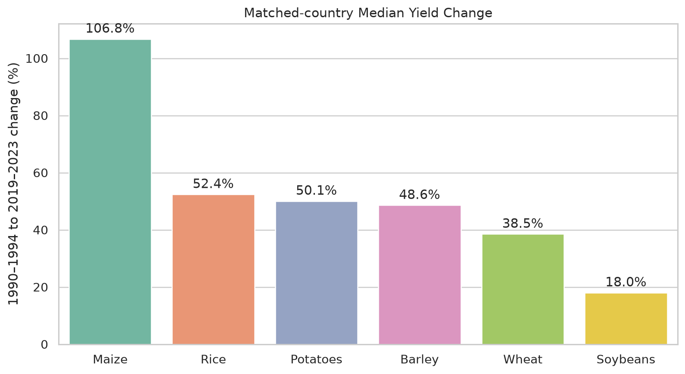
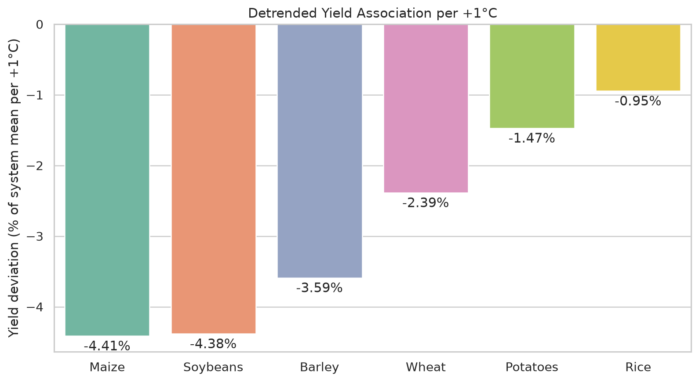
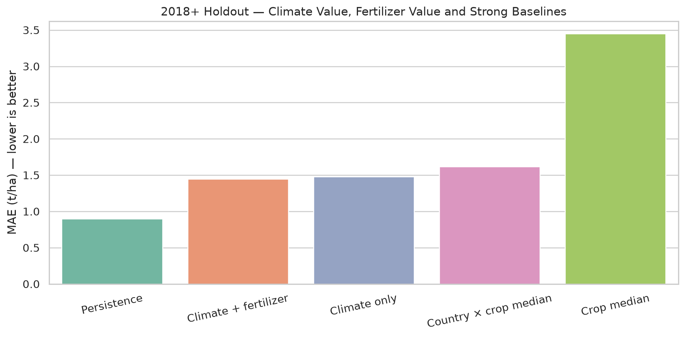

# Climate Crop Yield Intelligence 🌾🌍

### From warming to yield: where climate pressure appears first.

[](https://github.com/Wadee19/climate-crop-yield-intelligence/actions/workflows/ci.yml)
[](https://github.com/Wadee19/climate-crop-yield-intelligence/actions/workflows/live-data-validation.yml)


## What is this project?

This is a business-first data science case study about climate, farm conditions and crop yield.

The main question is simple:

> **Which crop-location combinations deserve attention first, and does annual climate information improve yield prediction beyond simple historical baselines?**

I use public data for **six crops**, **187 countries / territories**, and **1990–2023**.

The project is not trying to prove that temperature causes a specific yield change. I use the data as a **screening and prediction problem**, and I keep the limitations visible.

### The short answer

- Yield increased strongly over time, but not equally across crops.
- After removing long-term trends and normalizing for crop scale, all six crops show a negative annual temperature-yield association.
- A climate-only model improves on a static historical median, and fertilizer adds a small extra improvement.
- **Persistence — the last observed pre-2018 yield — is still the strongest short-horizon baseline.**

That last result is important. I keep it instead of forcing the ML model to look better than it is.

---

## V1 at a glance

| | Live validated result |
|---|---:|
| Country × year × crop rows | **24,892** |
| Countries / territories | **187** |
| Crops | **6** |
| Analysis period | **1990–2023** |
| Yield coverage | **100%** |
| Temperature / precipitation coverage | **97.59%** |
| Fertilizer coverage | **97.15%** |
| Irrigation coverage | **22.64%** |

Crops: `Wheat` · `Maize` · `Rice` · `Potatoes` · `Soybeans` · `Barley`

---

## Three charts that tell the story

### 1. Long-run yield change, using the same country cohort in both periods



I compare **1990–1994** with **2019–2023**, but only for country-crop histories observed in both windows.

| Crop | Median yield change |
|---|---:|
| Maize | **+106.75%** |
| Rice | **+52.40%** |
| Potatoes | **+50.06%** |
| Barley | **+48.59%** |
| Wheat | **+38.51%** |
| Soybeans | **+18.02%** |

Why I changed this: a simple early-vs-late comparison can move because the available countries changed. Matching the same countries makes the comparison cleaner.

### 2. Temperature sensitivity in relative units



I first remove the linear time trend inside each country × crop history. Then I express the yield residual as a percentage of that system's mean yield.

| Crop | Detrended yield association per +1°C |
|---|---:|
| Maize | **-4.41%** |
| Soybeans | **-4.38%** |
| Barley | **-3.59%** |
| Wheat | **-2.39%** |
| Potatoes | **-1.47%** |
| Rice | **-0.95%** |

Why I changed this: raw `t/ha per °C` made high-yield crops such as potatoes look mechanically more sensitive. Relative `% yield per +1°C` is a fairer cross-crop comparison.

These are **descriptive associations, not causal effects**.

### 3. Climate value, fertilizer value and strong baselines



The prediction experiment trains on **1990–2017** and tests on **2018–2023**.

| 2018+ holdout | MAE, t/ha |
|---|---:|
| Persistence: last pre-2018 yield | **0.8976** |
| Climate + fertilizer | **1.4473** |
| Climate only | **1.4816** |
| Country × crop historical median | **1.6192** |
| Crop median | **3.4478** |

Climate-only improves on the static country × crop median by **8.50%**. Adding fertilizer improves MAE by another **2.32%** relative to climate-only. The full model reaches **R² = 0.9038**.

But persistence is still clearly better.

> **Main decision message:** annual country-level climate information adds signal, but recent production history carries more short-horizon predictive value in this V1 dataset.

---

## Where should I investigate first?

The V1 priority screen combines two scale-aware signals:

- detrended yield volatility in percentage points;
- negative detrended temperature association in `% yield per +1°C`.

A country-crop history needs at least **20 usable observations** before it can enter the ranking.

Top five validated segments:

| Priority | Country | Crop | Screening score |
|---:|---|---|---:|
| 1 | Oman | Barley | **0.9930** |
| 2 | Turkmenistan | Maize | **0.9916** |
| 3 | Cape Verde | Maize | **0.9839** |
| 4 | Malawi | Wheat | **0.9832** |
| 5 | Rwanda | Potatoes | **0.9783** |

This is a **screening score**, not a probability of crop loss and not a causal climate-damage estimate.

---

## My decision story

I keep the reasoning visible instead of hiding it inside code.

A few examples:

- I found that crop yield scales were very different, so I moved the public sensitivity comparison from raw `t/ha` to relative `% yield`.
- I found that early and recent samples could contain different countries, so I matched the same country cohort across both periods.
- I found that fertilizer was being mixed into the word “climate”, so I separated **climate only** from **climate + fertilizer**.
- I found that full-period climate normals would leak future information into the prediction experiment, so predictive anomalies use **training years only**.
- I found that irrigation coverage was only **22.64%**, so I kept it exploratory instead of mostly imputing it into the model.
- I found that a complex model can look strong against a weak baseline, so I kept **persistence** as the hardest reference.

The full plain-English reasoning trail is in [`docs/decision_story.md`](docs/decision_story.md).

---

## Data

The notebook downloads public data from reproducible Our World in Data Grapher CSV endpoints.

- **Crop yields:** FAO Production: Crops and livestock products
- **Temperature & precipitation:** Copernicus Climate Change Service / ERA5
- **Fertilizer & irrigation:** FAO / World Bank indicator series

Only three-letter country / territory codes are kept. OWID aggregates such as `OWID_AFR` and `OWID_WRL` are excluded.

See [`docs/data_sources.md`](docs/data_sources.md) and [`docs/methodology.md`](docs/methodology.md).

---

## Modeling design

**Train:** 1990–2017  
**Test:** 2018–2023

The predictive experiment starts from each country × crop's historical training-period median yield and learns a residual correction.

### Climate-only model

- temperature anomaly
- precipitation anomaly
- crop identity

### Climate + fertilizer model

- temperature anomaly
- precipitation anomaly
- fertilizer anomaly
- crop identity

All anomaly normals are calculated from the **training period only**.

Random Forest settings:

- `n_estimators = 250`
- `min_samples_leaf = 5`
- `random_state = 42`

These values were fixed before evaluating the 2018+ holdout and were **not tuned on the test period**.

---

## Reproducibility

The live GitHub Actions workflow does all of the following from a clean runner:

1. downloads the public data;
2. rebuilds and validates the panel;
3. runs the package analysis;
4. generates the validated figures;
5. executes the standalone portfolio notebook end to end;
6. compares notebook headline results with package results;
7. uploads the summaries, figures and executed notebook as artifacts.

Current validation status:

- **CI:** PASS
- **Live data build:** PASS
- **Full analysis:** PASS
- **Notebook Run All:** PASS
- **Notebook ↔ package parity:** PASS
- **Artifact generation:** PASS

The validated environment is pinned in `requirements.txt`.

---

## Notebook

Main notebook:

[`notebooks/01_climate_crop_yield_business_analysis.ipynb`](notebooks/01_climate_crop_yield_business_analysis.ipynb)

It is standalone for portfolio use:

- public data load directly from the source links;
- important choices are explained in simple first-person Markdown;
- the notebook does not require the local `src/` package to run;
- a normal CPU runtime is enough.

See [`RUN_IN_COLAB.md`](RUN_IN_COLAB.md).

---

## Project structure

```text
climate-crop-yield-intelligence/
├── .github/workflows/
│   ├── ci.yml
│   └── live-data-validation.yml
├── data/
│   ├── raw/
│   └── processed/
├── docs/
│   ├── data_sources.md
│   ├── decision_story.md
│   ├── methodology.md
│   └── project_history.md
├── notebooks/
│   └── 01_climate_crop_yield_business_analysis.ipynb
├── reports/
│   ├── figures/
│   └── tables/
├── scripts/
│   └── run_live_analysis.py
├── slides/
│   └── presentation_story.md
├── src/climate_crop_yield/
│   ├── analysis.py
│   ├── data.py
│   ├── features.py
│   ├── model.py
│   └── plots.py
├── tests/
├── README.md
├── RUN_IN_COLAB.md
├── pyproject.toml
└── requirements.txt
```

---

## What V1 does not claim

This project does **not** claim that temperature, precipitation, fertilizer or irrigation cause the observed yield changes.

Country-year data cannot directly capture growing-season heat extremes, rainfall timing, crop calendars, local soils, cultivar choice, planting dates, irrigation efficiency, farm-level management, prices or policy changes.

The priority screen is not an insurance model. The predictive model is not a farm-level forecasting system.

The clearest next upgrade is more local, growing-season-specific data.

---

## Presentation

### **From Warming to Yield — Where Climate Pressure Appears First**

See [`slides/presentation_story.md`](slides/presentation_story.md).

---

<details>
<summary><strong>Project history</strong></summary>

The core business idea was first explored in a university analysis around **2022**.

The **2026** version was rebuilt from the ground up with updated public data, stronger methodology, matched-country comparisons, scale-aware climate analysis, time-aware model evaluation, ablation, strong baselines, tests and automated parity checks.

**v1.0 is the first portfolio release.**

The old university notebook is not included in the main repository; it is retained only as historical source material and a style reference.

</details>

---

## Author

**Ahmed Wadee**  
Data Science · AI · Engineering
